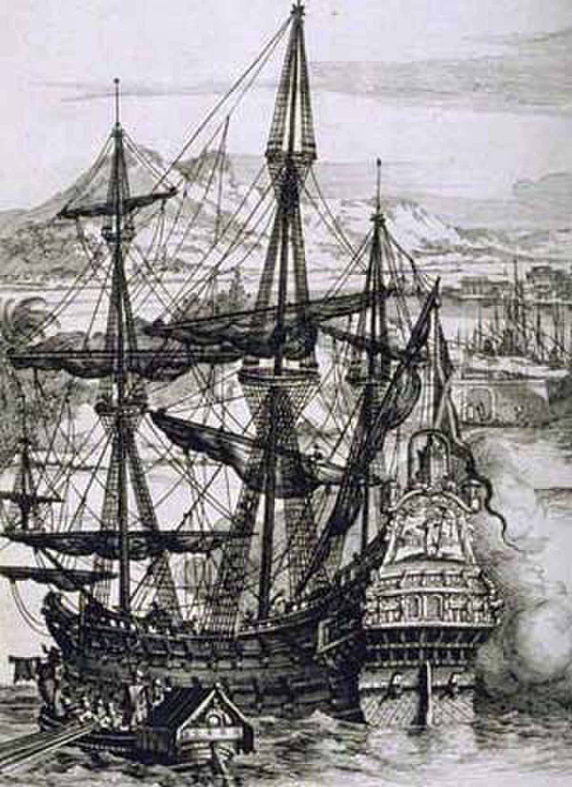

```{=html}
<canvas id="ocean-canvas"></canvas>

<div class="pirate-hero">

  <div class="hero-text">
    <p class="hero-eyebrow"><span>CS-E5480 Digital Ethics</span><span class="eyebrow-dot">·</span><span>Group Presentation</span></p>
    <h1 class="hero-title">Digital Piracy</h1>
    <p class="hero-subtitle">An Ethical Examination</p>
    <p class="hero-intro">
      Piracy resists easy moral judgment. Depending on whose interests are
      foregrounded — the consumer priced out of fragmented platforms, the creator
      whose livelihood depends on compensation, or the buyer who discovers their
      "purchase" was only ever a licence — the same act can appear as a rational
      response, an ethical violation, or a symptom of a broken system. These three
      perspectives do not converge on a verdict; they map the terrain of a genuinely
      contested problem.
    </p>
  </div>

  <div class="hero-image">
    <figure class="ship-frame">
      
      <figcaption class="ship-caption">Anonymous, <em>A Spanish Galleon</em>, mid-17th&nbsp;century engraving. Public domain.</figcaption>
    </figure>
  </div>

</div>

<div class="skull-ornament" aria-hidden="true">
  <span>☠&ensp;Chart the Course&ensp;☠</span>
</div>

<p class="section-label">Three Perspectives</p>

<div class="map-grid">
  <a class="map-card" href="consumers.qmd">
    <p class="card-roman">I</p>
    <p class="card-title">The Consumer's Perspective</p>
    <p class="card-teaser">How fragmented streaming landscapes and rising subscription costs reframe piracy as a rational — if not justifiable — choice.</p>
    <span class="card-sail">Set Sail &rarr;</span>
  </a>
  <a class="map-card" href="creators.qmd">
    <p class="card-roman">II</p>
    <p class="card-title">The Creator's Perspective</p>
    <p class="card-teaser">Economic and moral rights under the Berne Convention, and what three philosophical frameworks reveal about the ethics of unpaid use.</p>
    <span class="card-sail">Set Sail &rarr;</span>
  </a>
  <a class="map-card" href="ownership.qmd">
    <p class="card-roman">III</p>
    <p class="card-title">Ownership and Licensing</p>
    <p class="card-teaser">When clicking "Buy" delivers a revocable licence instead of property, the ethical calculus of piracy shifts in ways the law has not caught up with.</p>
    <span class="card-sail">Set Sail &rarr;</span>
  </a>
</div>

<script>
(function () {
  var canvas = document.getElementById('ocean-canvas');
  if (!canvas) return;
  var ctx = canvas.getContext('2d');
  function resize() { canvas.width = window.innerWidth; canvas.height = window.innerHeight; }
  resize();
  window.addEventListener('resize', resize);
  var motes = [];
  for (var i = 0; i < 55; i++) {
    motes.push({
      x: Math.random() * window.innerWidth,
      y: Math.random() * window.innerHeight,
      r: Math.random() * 1.4 + 0.4,
      speedX: (Math.random() - 0.5) * 0.25,
      speedY: -(Math.random() * 0.35 + 0.08),
      alpha: Math.random() * 0.35 + 0.05,
      hue: Math.random() * 22 + 33
    });
  }
  function draw() {
    ctx.clearRect(0, 0, canvas.width, canvas.height);
    motes.forEach(function (m) {
      m.x += m.speedX; m.y += m.speedY;
      if (m.y < -6) { m.y = canvas.height + 6; m.x = Math.random() * canvas.width; }
      ctx.beginPath();
      ctx.arc(m.x, m.y, m.r, 0, Math.PI * 2);
      ctx.fillStyle = 'hsla(' + m.hue + ',75%,58%,' + m.alpha + ')';
      ctx.fill();
    });
    requestAnimationFrame(draw);
  }
  draw();
})();
</script>
```
